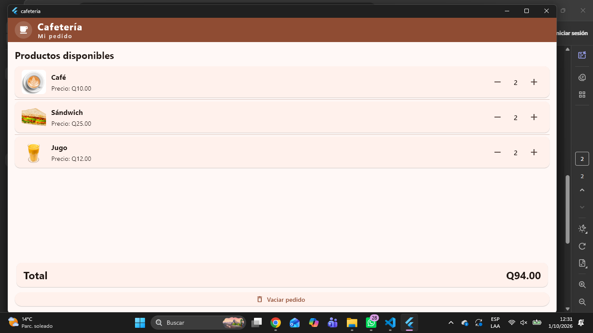

# Cafetería — Pantalla "Mi pedido"

Laboratorio de Flutter: pantalla de pedido de una cafetería con tres productos,
control de cantidades, total en quetzales y botón para vaciar el pedido.

## Estructura

```
lib/
  main.dart                      # CafeteriaApp: tema Material 3 y pantalla inicial
  models/producto.dart           # Modelo Producto (nombre, precio, imagen, cantidad)
  widgets/producto_pedido.dart   # Fila reutilizable de un producto con sus controles
  screens/mi_pedido_screen.dart  # Estado local con setState, lista y total
assets/img/                      # Imágenes de los productos y captura de pantalla
```

## Cómo ejecutar

```bash
flutter pub get
flutter run        # o: flutter run -d windows
flutter test
flutter analyze
```

## Pantalla "Mi pedido"



*Captura con el pedido: 2 cafés (Q20.00), 1 sándwich (Q25.00) y 1 jugo
(Q12.00), total **Q57.00**.*

## ¿Cómo calcula el total?

El total no es un estado guardado, sino un **getter calculado** en
`MiPedidoScreen`:

```dart
double get _total => _productos.fold(0, (suma, p) => suma + p.subtotal);
```

Y en el modelo, `subtotal` multiplica precio por cantidad:

```dart
double get subtotal => precio * cantidad;
```

El flujo es:

1. `_cambiarCantidad(producto, delta)` modifica `producto.cantidad` dentro de un
   `setState` (y devuelve sin hacer nada si el resultado sería negativo).
2. Ese `setState` reconstruye la pantalla.
3. Al reconstruirse, `_total` vuelve a recorrer la lista y suma los subtotales
   actuales; el texto se muestra con `_total.toStringAsFixed(2)`.

Por eso el total **nunca puede quedar desincronizado** de las cantidades: no hay
dos copias del dato. Si se guardara el total en una variable aparte, bastaría
olvidar actualizarlo en algún camino para mostrar un valor incorrecto. Al ser un
getter derivado, solo existe una fuente de verdad: la lista `_productos`.
Para el caso de la captura: `10.00 × 2 + 25.00 × 1 + 12.00 × 1 = 57.00`.

## ¿Por qué conviene reutilizar `ProductoPedido`?

`ProductoPedido` es un `StatelessWidget` inmutable que recibe **datos y acciones
por parámetro** (`producto`, `onIncrementar`, `onDecrementar`) y no conoce a la
pantalla:

- **Una sola implementación de la fila:** agregar un producto nuevo es agregar un
  `Producto` a la lista; el `ListView` lo dibuja sin escribir código nuevo.
- **Sin acoplamiento:** el widget no sabe qué hay en la lista ni quién lo llama,
  así que se puede reutilizar en otra pantalla (otra pestaña, un pedido anterior,
  un carrito de compras) sin cambios.
- **Estado en un solo lugar:** la cantidad vive en `Producto` y la lógica de
  negocio en `MiPedidoScreen`; el widget solo refleja valores y emite
  `VoidCallback`. Es trivial probarlo por separado y evita duplicar `setState`.
- **Interfaz consistente:** tamaños, tipografías y el deshabilitado del botón `-`
  en cantidad `0` se aplican igual a todas las filas.