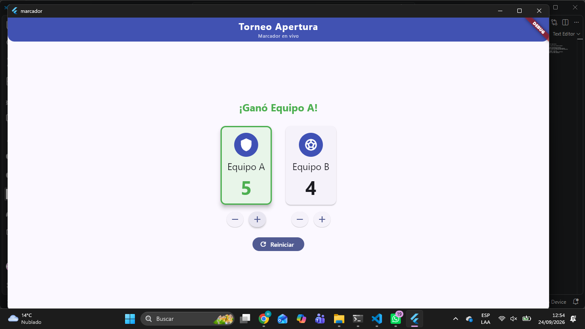
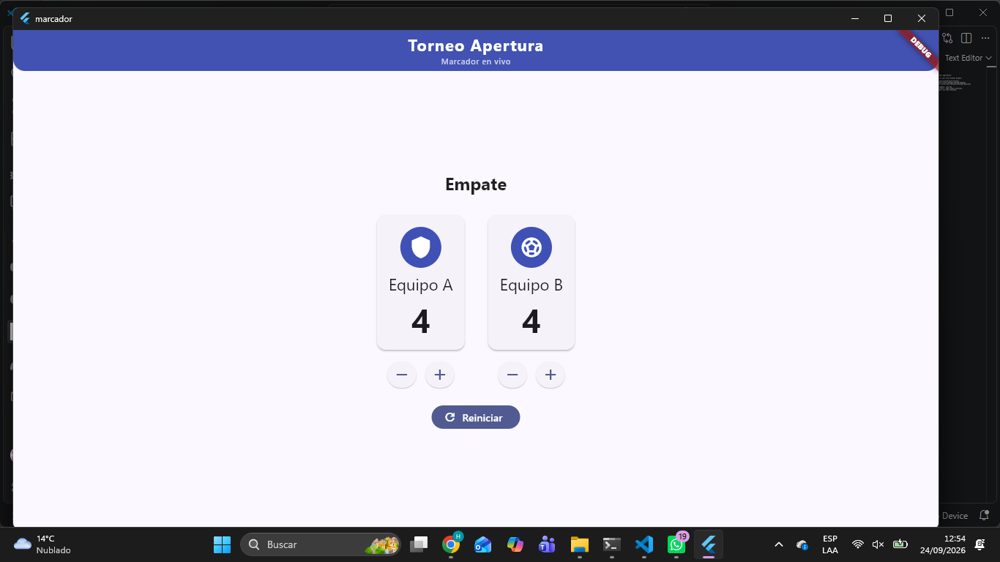

# Laboratorio: Marcador de Torneo Apertura

## Descripción
Aplicación desarrollada en Flutter para llevar el marcador de un partido entre dos equipos. Permite aumentar o disminuir los puntos de cada equipo, identificar visualmente qué equipo va ganando y reiniciar el marcador.

## Capturas de la aplicación

### Equipo A ganando
En esta captura, el Equipo A tiene más puntos que el Equipo B, por lo que se muestra como el equipo que va ganando.

### Equipo B ganando
En esta captura, el Equipo B tiene más puntos que el Equipo A, por lo que se muestra como el equipo que va ganando.

### Empate
En esta captura, ambos equipos tienen la misma cantidad de puntos, por lo que el estado se muestra como empate y se mantiene un color neutro.

### Reinicio
En esta captura, se reinicial el contador y ambos equipos tienen la misma cantidad de puntos, por lo que el estado se muestra como empate y se mantiene un color neutro.

## Funcionamiento de `setState`

Cuando se presiona uno de los botones para sumar o restar puntos, se utiliza `setState` para indicar a Flutter que el estado de la aplicación cambió. Esto hace que Flutter vuelva a construir la interfaz necesaria y muestre inmediatamente el nuevo marcador y el estado del partido.

Si se cambiaran los puntos sin llamar a `setState`, el valor de la variable podría cambiar internamente, pero Flutter no tendría la notificación necesaria para reconstruir la interfaz. Como consecuencia, el nuevo marcador no se mostraría inmediatamente en pantalla.
